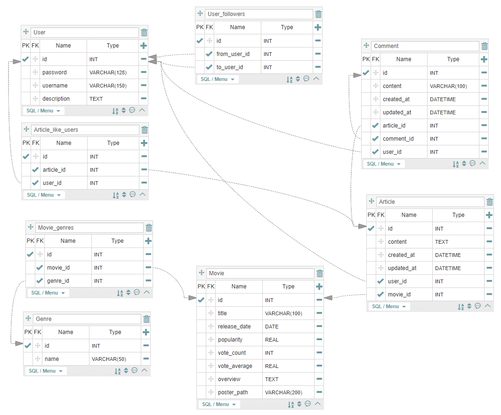

# README

> Django Restful API 서버와 Vue.js 웹프레임워크를 활용한 영화 리뷰 웹페이지 구현 프로젝트

## Venv

- python 3.7.7
- djangorestframework
- djangorestframework-jwt
- django-cors-headers
- django-seed

### Account

>  유저 모델을 관리하는 앱으로 회원가입, 로그인과 같은 인증 기능부터 사용자 간의 팔로우 기능을 더한 커스텀 유저 모델이 기존 유저 모델을 대체합니다.

- Model
  - `AbstractUser` 모델을 상속하여 작성했습니다.
  - 추가적인 필드로 자기소개, 이미지URL, 팔로워 필드를 추가했습니다.

- Serializer
  - `UserSerializer`는 회원가입과 로그인 시 유효성 검사에 필요합니다.
  - `ProfileSerializer`는 프로필에 필요한 팔로우 관계, 작성한 리뷰와 댓글들에 대한 정보를 담고 있습니다.

- URL
  - Restful한 설계를 하기 위해 주소에는 자원에 대한 정보를 담고 행위는 메서드로 구분했습니다.
  - JWT를 활용하여 로그인하기 때문에 회원가입과 로그인을 별도의 URL으로 분리했습니다.

- View
  - 회원가입은 비밀번호가 비밀번호 확인과 일치하는지 검사한 후 유저를 새롭게 생성합니다.
  - 프로필 정보, 팔로우, 이미지 변경은 동일한 경로에 메서드를 사용하여 행위를 구분합니다.

### Movie

> 영화와 관련된 데이터를 관리하는 앱 입니다.

- Fixture

  - 기존의 데이터베이스를 movies.json으로 불러와서 진행합니다.
  - 관리자는 언제든 형식에 맞춰 영화 데이터를 추가할 수 있습니다.

- Model & Serializer

  - `Movie` 모델과 `Genre` 모델을 생성했습니다. 장르 모델은 영화의 장르 코드를 장르명으로 바꿔주는 역할을 합니다.

  - 영화에 관한 모든 정보를 하나의 json 파일으로 응답할 수 있도록 해줍니다.

- URL & View

  - Restful한 설계를 위해 마찬가지로 동일 주소에 메서드를 명시했습니다.
  - 영화 목록은 처음 홈페이지에 접속하면 받아와야하기 때문에 인증없이 요청을 보낼 수 있습니다.
  - 영화를 수정, 삭제, 조회하는 행위는 JWT를 통한 인증이 필요합니다.

### Article

> 영화와 관련된 리뷰와 댓글을 관리하는 앱 입니다. 유저와 영화 모델을 참조하여 새로운 데이터를 생성합니다.

- Model & Serializer
  - `Review` 모델은 유저와 영화를 외래키로 가져오고 좋아요 기능을 위해 별도로 다대다 관계를 가지고 잇습니다.
  - 댓글은 유저와 리뷰를 참조하고 있습니다.
  - Serializer는 작성한 리뷰와 댓글들을 하나의 json 파일으로 응답하게 해줍니다.
- URL & View
  - Restful한 설계를 위해 마찬가지로 동일 주소에 메서드를 명시했습니다.
  - 리뷰와 댓글 작성 시 JWT를 통한 인증이 필요합니다.
  - 좋아요 기능은 응답 시 현재 상태를 함께 응답하여 상태 표시를 용이하도록 도와줍니다.

### ERD

​	